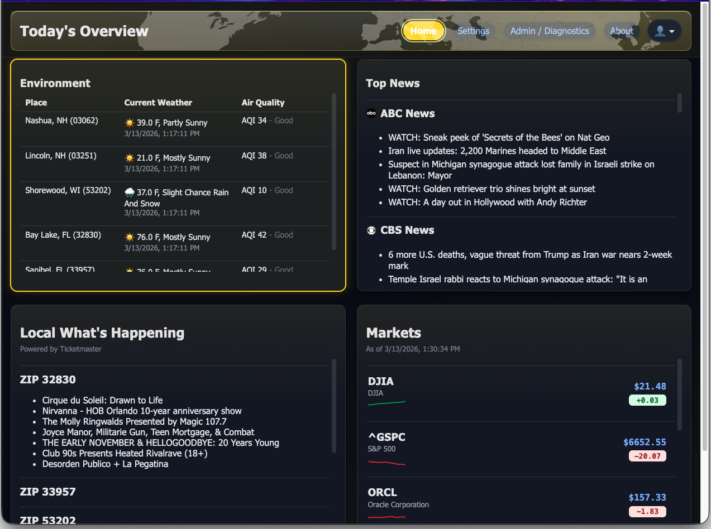
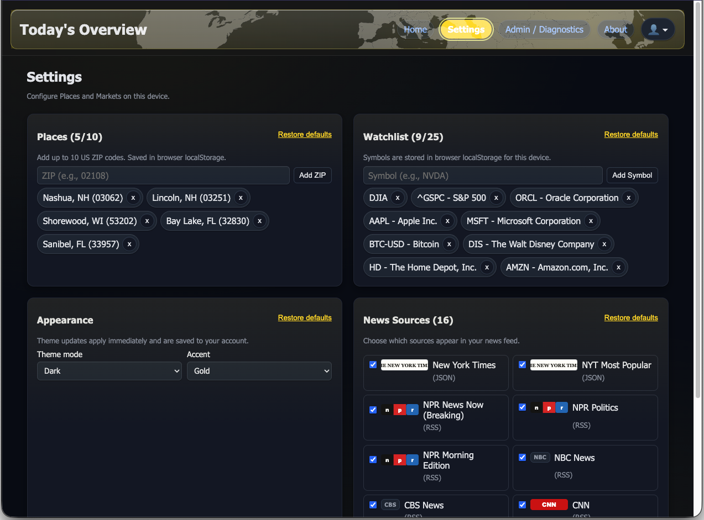
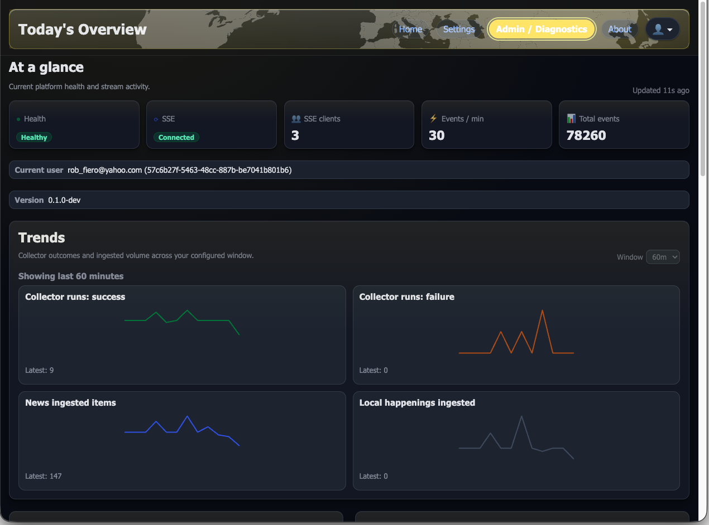
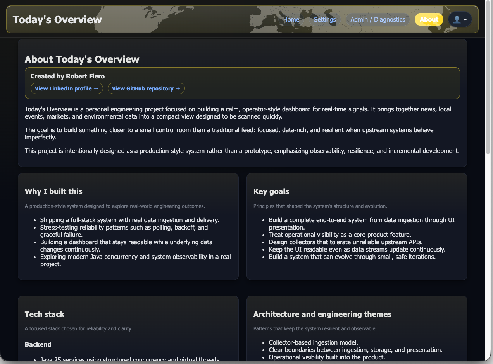
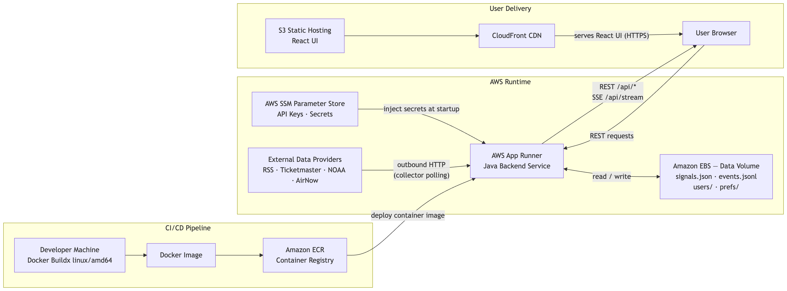

# Today's Overview

**A calm, operator-style dashboard for real-time signals — built as a production-minded system, not a prototype.**

Today's Overview is a personal full-stack engineering project that explores how to design and build a real-time signals platform with a focus on clarity, resilience, and operational visibility. It aggregates signals such as news, local events, markets, weather, and environmental data into a single, continuously updating dashboard.

The system is intentionally built with a production-style mindset: event-driven ingestion, streaming updates via Server-Sent Events (SSE), observable runtime behavior, and a working AWS deployment model (S3/CloudFront for the UI and App Runner for the backend). It also serves as a hands-on exploration of modern Java concurrency and AI-assisted engineering workflows.

## Live demo

https://todaysoverview.robfiero.net

Public demo of the deployed system running on AWS.

## Screenshots






## Key capabilities

- Real-time signals dashboard
- Collector-based ingestion architecture
- Server-Sent Events (SSE) streaming updates
- Admin / Diagnostics operational tooling
- Authentication with JWT + HttpOnly cookies
- Secure password hashing (Argon2id / PBKDF2 fallback)
- Password reset workflow
- User preferences storage
- Demo-safe operational diagnostics
- AI-assisted development workflow

## Architecture

The system is organized as a full-stack, event-driven dashboard. A React + Vite frontend is deployed to S3 and served through CloudFront, while a Java 25 backend runs on AWS App Runner and exposes REST + SSE endpoints.

High-level flow:

```text
Collectors
→ Scheduler Runtime
→ Event Store
→ REST + SSE Service
→ React Dashboard
```

### System Architecture


### AWS Deployment



## Technology Stack

**Frontend**
- React
- Vite
- TypeScript

**Backend**
- Java 25
- Maven (multi-module)
- REST + SSE APIs

**Infrastructure**
- AWS App Runner
- Amazon ECR
- Amazon S3
- CloudFront CDN
- AWS Systems Manager Parameter Store

## AI-Assisted Engineering Workflow

ChatGPT and Codex were used throughout development to:

- explore design approaches and tradeoffs
- accelerate targeted implementation
- improve test coverage and iteration speed
- refine UX and system behavior

## Project goals

- Build a calm, operator-style dashboard instead of a noisy feed
- Treat operational visibility as a first-class feature
- Stress-test reliability patterns across imperfect upstream sources
- Maintain a production-style posture: resilience, observability, safe defaults
- Apply modern Java concurrency in a real system
- Iterate using an AI-assisted development workflow

## Admin / Diagnostics

Operational visibility tooling including collector health, live activity, and diagnostics, with sensitive data sanitized for safe public demo use.

## Project metrics

Snapshot metrics (heuristic):

- ~240 files
- ~33k lines of code
- Java-heavy backend with supporting TypeScript UI

## Code Coverage

The backend is built with comprehensive test coverage across three modules:

- **Overall:** 87% instruction coverage, 64% branch coverage, 909 LOC tested  
- **Core:** 97% instruction coverage, 88% branch coverage (33 classes)  
- **Collectors:** 85% instruction coverage, 63% branch coverage (22 classes)

## Security notes

- JWT-based authentication (HttpOnly cookies)
- Secure password hashing (Argon2id with PBKDF2 fallback)
- Password reset with expiring, one-time-use tokens
- Sanitized diagnostics for safe demo exposure

## Requirements

- Java 25
- Maven 3.9+
- Node.js 18+

## Running locally

### Backend

```bash
cd scripts
./release-backend.sh dev
```

Runs at: http://localhost:8080

### UI

```bash
cd scripts
./release-ui.sh dev
```

Runs at: http://localhost:5173

---

## Cloud deployment (AWS)

The system is deployed on AWS:

- Backend: AWS App Runner (containerized Java service)
- UI: S3 + CloudFront
- Secrets: AWS Systems Manager Parameter Store

### Deployment commands

**Backend**

```bash
./scripts/release-backend.sh prod <repository> <app-runner-service-arn> [aws-profile]
```

**UI**

```bash
./scripts/release-ui.sh prod <s3-bucket> <cloudfront-distribution-id> [aws-profile]
```

## Repository scripts

- `release-backend.sh` — build and deploy backend
- `release-ui.sh` — build and deploy UI

## Future improvements

- Custom domain with Route 53
- CI/CD pipeline for automated deployments
- Expanded observability and metrics
- Continued dashboard and UX refinements

## Project status

Active personal engineering project demonstrating production-style system design and modern development practices.
